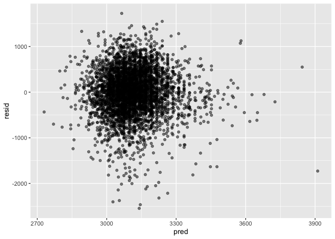

P8015_Hw6_agd2159
================
Zander De Jesus
12-2-2023

``` r
library(tidyverse)
library(modelr)
library(mgcv)
library(rnoaa)
library(patchwork)
set.seed(1234)

theme_set(theme(legend.position = "bottom"))

options(
  ggplot2.continuous.colour = "viridis",
  ggplot2.continuous.fill = "viridis"
)

scale_colour_discrete = scale_colour_viridis_d
scale_fill_discrete = scale_fill_viridis_d
```

# Problem 1: Washington Post Homicide Data Exploration and Linear Modeling

Begin by importing and cleaning the csv in a similar method to Homework
5. This case study analysis asks us to create a binary categorical
variable from case disposition, filter out more cities, and focus
specifically on White and Black victims.

``` r
wp_homicides = 
  read_csv("data/homicide-data.csv", na = c("", "NA", "Unknown")) |> 
  mutate(city_state = str_c(city, state, sep = ", "),
    victim_age = as.numeric(victim_age),
    resolution = case_when(
      disposition == "Closed without arrest" ~ 0,
      disposition == "Open/No arrest"        ~ 0,
      disposition == "Closed by arrest"      ~ 1)) |> 
  filter(victim_race %in% c("White", "Black")) |> 
  filter(!(city_state %in% c("Tulsa, AL", "Dallas, TX", "Phoenix, AZ", "Kansas City, MO"))) |> 
  select(city_state, resolution, victim_age, victim_sex, victim_race)
```

    ## Rows: 52179 Columns: 12
    ## ── Column specification ────────────────────────────────────────────────────────
    ## Delimiter: ","
    ## chr (8): uid, victim_last, victim_first, victim_race, victim_sex, city, stat...
    ## dbl (4): reported_date, victim_age, lat, lon
    ## 
    ## ℹ Use `spec()` to retrieve the full column specification for this data.
    ## ℹ Specify the column types or set `show_col_types = FALSE` to quiet this message.

First we will analyze a regression on Baltimore before applying the
whole linear model to every city in the data set using a map function.

``` r
baltimore_glm = 
  filter(wp_homicides, city_state == "Baltimore, MD") |> 
  glm(resolution ~ victim_age + victim_sex + victim_race, family = binomial(), data = _)

baltimore_glm |> 
  broom::tidy() |> 
  mutate(
    OR = exp(estimate), 
    OR_CI_upper = exp(estimate + 1.96 * std.error),
    OR_CI_lower = exp(estimate - 1.96 * std.error)) |> 
  filter(term == "victim_sexMale") |> 
  select(OR, OR_CI_lower, OR_CI_upper) |>
  knitr::kable(digits = 3)
```

|    OR | OR_CI_lower | OR_CI_upper |
|------:|------------:|------------:|
| 0.426 |       0.325 |       0.558 |

The Odds Ratio displayed in this regression model is 0.426, and the 95%
Confidence Interval does not include the null value of 1. Therefore, is
statistical test indicates that the predictor variable male sex has a
statistically significant association with reducing crime case
resolution.

The regression analysis in this general linear model is then expanded to
all cities within the dataset using functions and unnesting subsequent
analysis.

``` r
fullcities_glm = wp_homicides |> 
  nest(data = -city_state) |> 
  mutate(
    models = map(data, \(df) glm(resolution ~ victim_age + victim_sex + victim_race, 
                                 family = binomial(), data = df)),
    cleaned_models = map(models, broom::tidy)) |> 
  select(-models, -data) |> 
  unnest(cols = cleaned_models) |> 
  mutate(
    OR = exp(estimate), 
    OR_CI_upper = exp(estimate + 1.96 * std.error),
    OR_CI_lower = exp(estimate - 1.96 * std.error)) |> 
  filter(term == "victim_sexMale") |> 
  select(city_state, OR, OR_CI_lower, OR_CI_upper)

fullcities_glm |> 
  slice(1:5) |> 
  knitr::kable(digits = 3)
```

| city_state      |    OR | OR_CI_lower | OR_CI_upper |
|:----------------|------:|------------:|------------:|
| Albuquerque, NM | 1.767 |       0.831 |       3.761 |
| Atlanta, GA     | 1.000 |       0.684 |       1.463 |
| Baltimore, MD   | 0.426 |       0.325 |       0.558 |
| Baton Rouge, LA | 0.381 |       0.209 |       0.695 |
| Birmingham, AL  | 0.870 |       0.574 |       1.318 |

Plotting these regression values together:

``` r
fullcities_glm |> 
  mutate(city_state = fct_reorder(city_state, OR)) |> 
  ggplot(aes(x = city_state, y = OR)) + 
  geom_point() + 
  geom_errorbar(aes(ymin = OR_CI_lower, ymax = OR_CI_upper)) + 
  theme(axis.text.x = element_text(angle = 90, hjust = 1))
```

<!-- -->

The majority of cities in this regression analysis have odds ratios with
CI’s that are lower than the null value of one, indicating statistically
significant association of lower case resolution for male victims. 3
cities, Fresno CA, Stockton, CA, and Albuquerque, NM, have positive
statistically significant associations between male victims receiving
closed cases.

# Problem 2: Bootstrapping Weather Data

``` r
weather_df = 
  rnoaa::meteo_pull_monitors(
    c("USW00094728"),
    var = c("PRCP", "TMIN", "TMAX"), 
    date_min = "2022-01-01",
    date_max = "2022-12-31") |>
  mutate(
    name = recode(id, USW00094728 = "CentralPark_NY"),
    tmin = tmin / 10,
    tmax = tmax / 10) |>
  select(name, id, everything())
```

    ## using cached file: /Users/zanderdj/Library/Caches/org.R-project.R/R/rnoaa/noaa_ghcnd/USW00094728.dly

    ## date created (size, mb): 2023-10-31 11:07:04.036221 (8.538)

    ## file min/max dates: 1869-01-01 / 2023-10-31

# Problem 3: Cross Validation of Developed Linear Regression - Birthweight Dataset

For this problem, we are given a csv dataset on recorded birthweights,
and the values of many potential variables that could be predictive
indicators that influence birthweight. Once this data is imported below,
we are asked to explore the data and identify a few predictor variables
that can be tested for their potential association with birthweight in a
linear regression model.

Four variables were categorical in nature, and converted from numeric
data to factor values.

``` r
birthweight_df = read_csv("data/birthweight.csv", na = c("", "NA", "Unknown")) |> 
  janitor::clean_names()
```

    ## Rows: 4342 Columns: 20
    ## ── Column specification ────────────────────────────────────────────────────────
    ## Delimiter: ","
    ## dbl (20): babysex, bhead, blength, bwt, delwt, fincome, frace, gaweeks, malf...
    ## 
    ## ℹ Use `spec()` to retrieve the full column specification for this data.
    ## ℹ Specify the column types or set `show_col_types = FALSE` to quiet this message.

``` r
#Converting Categorical Variables from Factor to Numeric
birthweight_df = birthweight_df |> 
  mutate(babysex = as.factor(babysex),
         malform = as.factor(malform),
         frace = as.factor(frace),
         mrace = as.factor(mrace),
         )
```

**Variable Selection**: For this Problem, I will be choosing the 3
columns `smoken`: mean number of cigarettes smoked daily by mother,
`malform`: presence of birth defect / malformations in development, and
`ppwt`: mother’s pre-pregnancy weight. I have chosen these three
variables due to exisiting research across literature that identifies
that smoking during pregnancy can lead to increased development of birth
defect, miscarriage, and SIDS after pregnancy (source:
<https://www.cdc.gov/tobacco/campaign/tips/diseases/pregnancy.html>).
Similarly, the addictive characteristics of nicotine in cigarettes can
depress appetite, limit caloric intake, and lead to signficant weight
loss in smokers, and the potential impact that being an underweight
women may have on developing a child in utero.

Ahead of fitting these predictor variables to the response variable of
birthweight `bwt`, I hypothesize that the three predictor variables
**will each have a statistically significant association with
birthweight, where both increased smoking and presence of malformations
will have a negative association with birthweight, and lower mother
weight will correspond with lower birthweight.**

I began by also running quick scatterplots of the available data for
these 3 predictor variables using `geom_point`:

``` r
birthweight_df |> 
  ggplot(aes(x = smoken, y = bwt)) +
  geom_point(alpha = 0.5) +
  geom_smooth()
```

    ## `geom_smooth()` using method = 'gam' and formula = 'y ~ s(x, bs = "cs")'

<!-- -->

``` r
birthweight_df |> 
  ggplot(aes(x = ppwt, y = bwt)) +
  geom_point(alpha = 0.5) +
  geom_smooth()
```

    ## `geom_smooth()` using method = 'gam' and formula = 'y ~ s(x, bs = "cs")'

<!-- -->

``` r
birthweight_df |> 
  ggplot(aes(x = malform, y = bwt)) +
  geom_point(alpha = 0.5)
```

<!-- -->

Moderate interactions appear to exist for number of cigarettes and
parent weight. I predict that malformations may have the highest chance
of no statistically significant association with birthweight, but this
may be due to the low sample size of malformations in this study.

**Creating the linear model:** There appear to be no missing values in
these 3 predictor variables and in response variable birthweight when
using `drop_na`.

``` r
birthwt_lm = birthweight_df |>
  select(bwt, smoken, malform, ppwt) |> 
  drop_na() |> 
  lm(bwt ~ smoken + malform + ppwt, data = _)

birthwt_lm |> 
  broom::tidy() |> 
  knitr::kable(digits = 4)
```

| term        |  estimate | std.error | statistic | p.value |
|:------------|----------:|----------:|----------:|--------:|
| (Intercept) | 2554.1504 |   47.3428 |   53.9501 |  0.0000 |
| smoken      |   -5.7397 |    1.0297 |   -5.5741 |  0.0000 |
| malform1    |   41.1530 |  129.8859 |    0.3168 |  0.7514 |
| ppwt        |    4.7283 |    0.3781 |   12.5047 |  0.0000 |

``` r
birthwt_lm |> 
  broom::glance() |> 
  knitr::kable(digits = 4)
```

| r.squared | adj.r.squared |    sigma | statistic | p.value |  df |    logLik |      AIC |      BIC |   deviance | df.residual | nobs |
|----------:|--------------:|---------:|----------:|--------:|----:|----------:|---------:|---------:|-----------:|------------:|-----:|
|    0.0403 |        0.0397 | 501.8945 |   60.7632 |       0 |   3 | -33159.28 | 66328.56 | 66360.44 | 1092733826 |        4338 | 4342 |

**Interpretation of this initial model:** The initial tibble produced
using `broom:tidy()` shows that the ‘smoken’ predictor has a
statistically significant negative association and the ‘ppwt’ predictor
has a statistically significant positive association. Presence of
malformations did not have a statistically significant association with
birthweight.

However, the second table produced using `broom::glance` shows that
**this model has a very low r squared value of 0.0403** This means that
the variation in birthweight explained by this linear model is small and
largely left unexplained, and more predictors should be included. It is
likely that this basic model is producing inaccurate statistical
inferencing and may have several confounding covariates.

### Plotting residuals of predictors using modelr

``` r
birthweight_df |>
  modelr::add_predictions(birthwt_lm) |> 
  modelr::add_residuals(birthwt_lm) |> 
ggplot(aes(x = pred, y = resid)) +
  geom_point(alpha = 0.5)
```

<!-- -->

## Prob. 3 Task 2 - Cross Validation with two other linear models:

How does this potential model compare to other linear models predicting
infant birthweight?

``` r
#Model 1 - Birth Length and Gestational Age in weeks as main effect predictors

length_gest_model = lm(bwt ~ blength + gaweeks, data = birthweight_df)

#Model 2 -  Interactivity implies multiplicative not additive model

circum_length_sex_model = lm(bwt ~ bhead*blength*babysex, data = birthweight_df)

#Gathering Predictions from three models of interest:
birthweight_df |> 
  gather_predictions(birthwt_lm, length_gest_model, circum_length_sex_model) |> 
  ggplot(aes(x = bwt, y = pred)) +
  geom_point(alpha = 0.3) + geom_smooth(se = FALSE, color = "red") + facet_grid(. ~ model) + 
  labs(title = "Visualizing gathered model predictions compared to birthweights for all three linear models")
```

    ## `geom_smooth()` using method = 'gam' and formula = 'y ~ s(x, bs = "cs")'

<!-- -->

This graphic appears to show that the birthweight model I made using
`smoken`, `malform`, and `ppwt`, does not have much predictive power in
comparison to the other comparative models. Trendline is near quite flat
across birth weights.

**Preparing Training Dataframe for Cross Validation, Guided by In-Class
Example and P8105 Website Video Example**

``` r
cv_df = 
  crossv_mc(birthweight_df, 100) |> 
  mutate(
    train = map(train, as_tibble),
    test = map(test, as_tibble)
  )

cv_results = 
  cv_df |> 
  mutate(
    birthwt_lm = map(train, \(df) lm(bwt ~ smoken + malform + ppwt, data = df)),
    length_gest_model = map(train, \(df) mgcv::gam(bwt ~ blength + gaweeks, data = df)),
    circum_length_sex_model = map(train, \(df) mgcv::gam(bwt ~ bhead*blength*babysex, data = df))) |> 
  mutate(
    rmse_birthwt_lm = map2_dbl(birthwt_lm, test, \(mod, df) rmse(mod, df)),
    rmse_length_gest = map2_dbl(length_gest_model, test, \(mod, df) rmse(mod, df)),
    rmse_circum_length_sex = map2_dbl(circum_length_sex_model, test, \(mod, df) rmse(mod, df))
    )
```

Now that this training dataframe is set up and RMSE can be iteratively
calculated, we can plot the RMSE of each model to see prediction
accuracy of the three models.

``` r
cv_results |> 
  select(starts_with("rmse")) |> 
  pivot_longer(
    everything(),
    names_to = "model_type",
    values_to = "rmse",
    names_prefix = "rmse_"
  ) |> 
  ggplot(aes(x = model_type, y = rmse, fill = model_type)) +
  geom_violin() +
  labs(
    title = "Comparing Root Means Squares Estimate for Predicting Infant Birthweight",
    x = "Model Type",
    y = "RMSE"
  )
```

<!-- -->

The lower the RMSE, the better predictive accuracy of a linear model.
This graph shows that the model I made for this problem set,
`birthwt_lm` **has the highest RMSE and worst predictive accuracy of the
three models**. This affirms what I saw using `broom::glance()` and
seeing that the R squared for this model was very low at 0.04. The
`circum_length_sex_model` has the best RMSE of the three and has the
most accurate predictive power. However, since RMSE is in the 100s for
all of these linear models, it is likely that a more complex model
containing more predictors and interactions should be designed for this
study.
